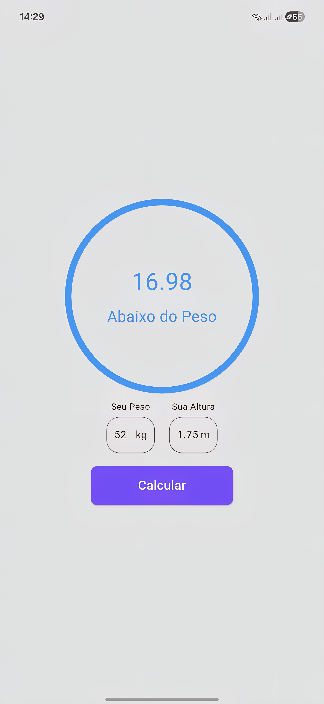
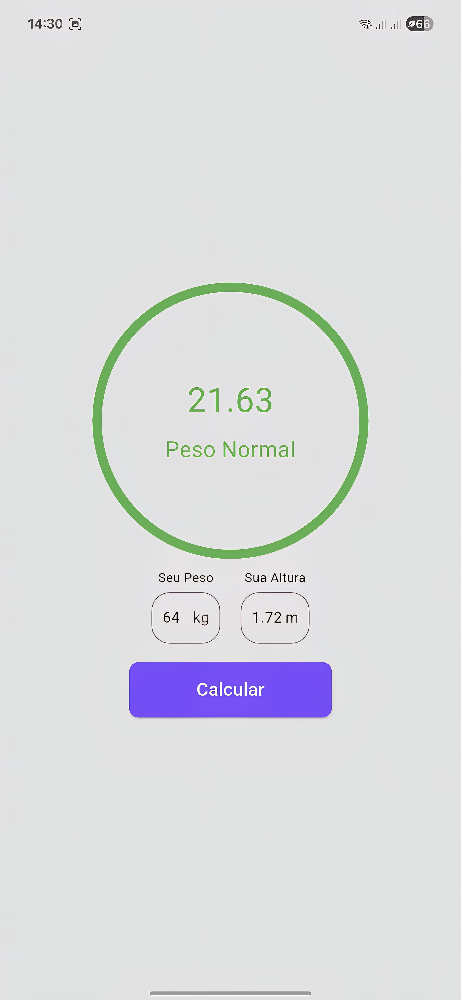
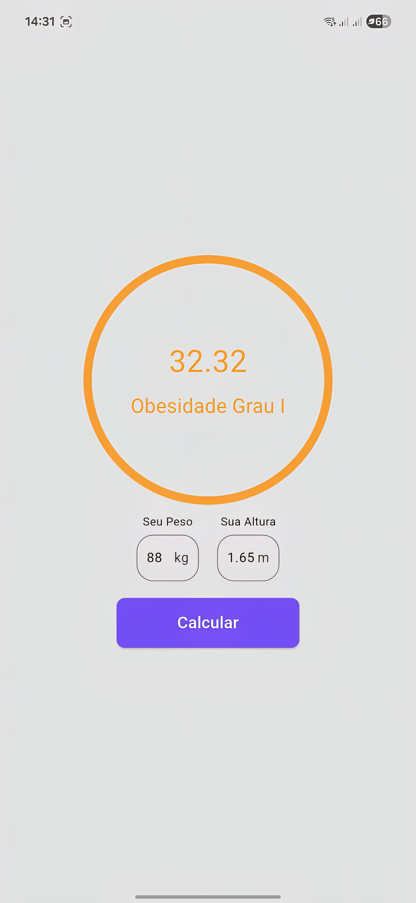
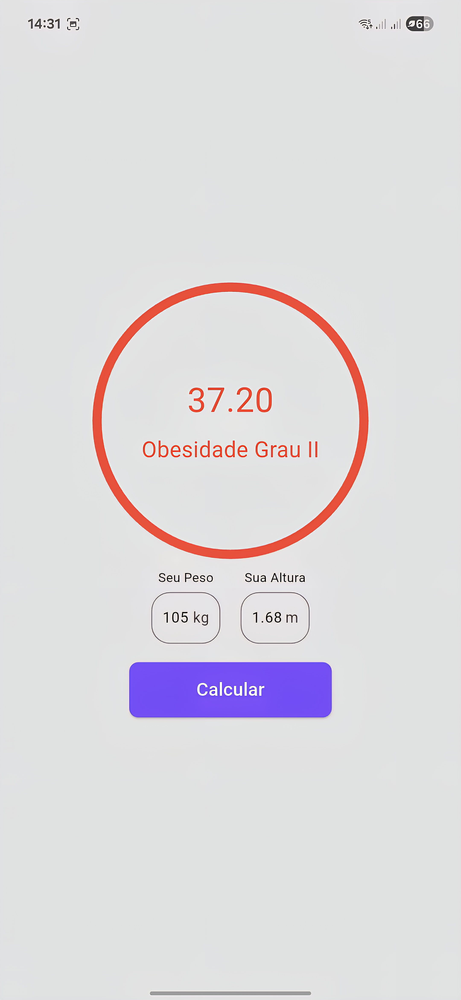
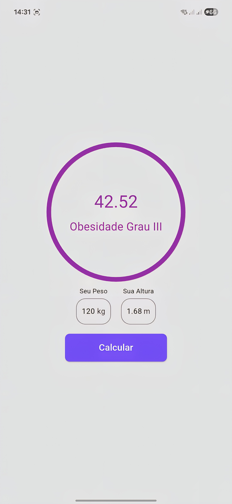

# 🧮 Calculadora de IMC - Flutter

Um app feito em Flutter para calcular o **Índice de Massa Corporal (IMC)**. Ideal para aprender conceitos básicos de Flutter e Dart.


## 🚀 Funcionalidades

- Inserção de peso e altura
- Cálculo instantâneo do IMC
- Exibição da classificação (Abaixo do peso, Normal, Sobrepeso, Obesidade, etc)
- Interface limpa e responsiva

## 📱 Preview
<p align="center">
    
    
    
</p>
<p align="center">
    <strong style="display:inline-block;width:250px;text-align:center; font-size:24px; margin-right:16px;">Abaixo do peso</strong>
    <strong style="display:inline-block;width:250px;text-align:center; font-size:24px; margin-right:16px;">Normal</strong>
    <strong style="display:inline-block;width:250px;text-align:center; font-size:24px;">Sobrepeso</strong>
</p>

<p align="center">
    
    
    
</p>
<p align="center">
    <strong style="display:inline-block;width:250px;text-align:center; font-size:24px; margin-right:16px;">Obesidade Grau 1</strong>
    <strong style="display:inline-block;width:250px;text-align:center; font-size:24px; margin-right:16px;">Obesidade Grau 2</strong>
    <strong style="display:inline-block;width:250px;text-align:center; font-size:24px;">Obesidade Grau 3</strong>
</p>


## 🧰 Tecnologias usadas

- [Flutter](https://flutter.dev/)
- [Dart](https://dart.dev/)
- Widgets nativos do Flutter (`TextField`, `ElevatedButton`, `Container`, etc)

## ▶️ Como rodar o projeto

1. **Clone o repositório**

```bash
git clone https://github.com/DevSamF/calculadora_imc.git
cd calculadora_imc
```
2. **Instale as Dependencias**

```bash
flutter pub get
```

3. **Execute em um emulador ou dispositivo físico**

```bash
flutter run
```
